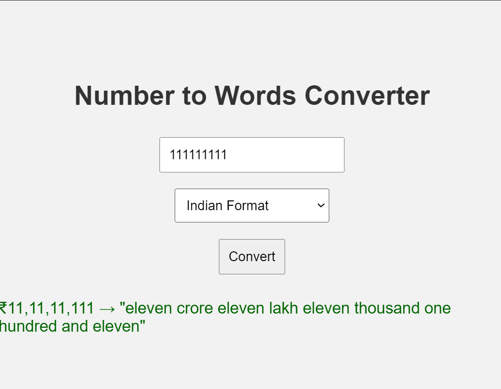

# Number to Words Converter 🌐🔢🗣️

A simple and responsive web app that converts numeric values into words using both **Indian** and **International** numbering systems.

## ✨ Features

- 🔢 Accepts any numeric input
- 🇮🇳 Indian format: Lakhs and Crores
- 🌍 International format: Thousands, Millions, and Billions
- 💱 Currency symbol formatting (₹ and $)
- 🧠 Converts large numbers into easy-to-read words
- 📱 Responsive and minimal UI

## 📸 Demo

 <!-- Replace with actual screenshot if hosting -->

## 🚀 How to Use

1. Enter a number in the input field.
2. Select the desired format:
   - **Indian Format**
   - **International Format**
3. Click **Convert**.
4. View the number in words along with the formatted currency.

## 🛠️ Tech Stack

- HTML5
- CSS3
- Vanilla JavaScript

## 📂 Project Structure

## 📄 License

This project is open-source and available under the [MIT License](LICENSE).

---

Made with ❤️ for number nerds and word wizards.

